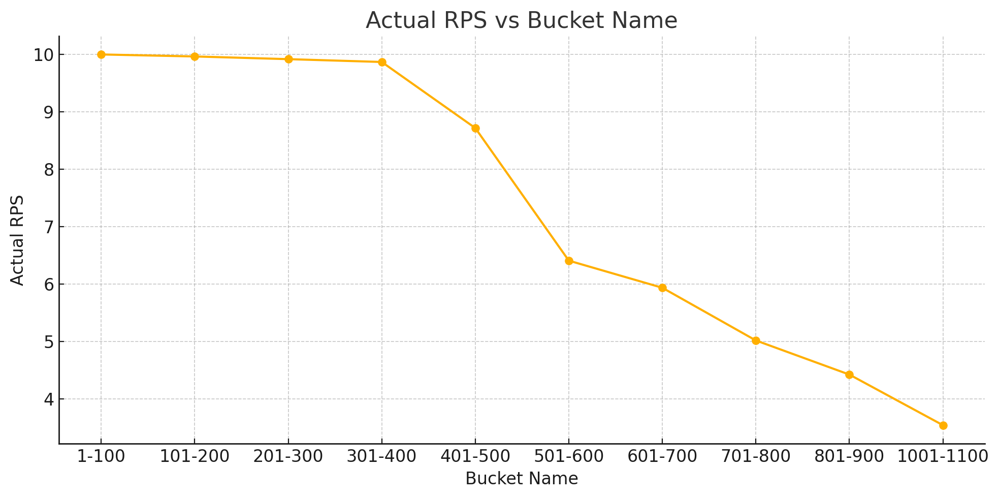

## LLM-based Text Toxicity Detection Service

A service was developed for automatic toxicity detection in text using large language models (LLMs). The project covered the full pipeline — from data analysis to deploying a high-performance production-ready service.

### Key achievements:

- **Data analysis**  
  Performed an initial analysis of the dataset, including input length distribution, class balance, and annotation quality assessment.

- **Model training**  
  Conducted a series of experiments using:
  - the **Hugging Face Trainer** framework  
  - **custom PyTorch and Transformers code** for full control and flexibility  
  Models were fine-tuned with **LoRA adapters** for efficient parameter adaptation.

- **Model optimization**  
  Applied **post-training quantization (PTQ)** using the **AWQ algorithm** with calibration data. This significantly reduced resource requirements with minimal quality loss.

- **Service assembly**  
  Used the **vLLM framework** for high-throughput inference. A REST API was implemented for interaction with the model.

- **Docker packaging**  
  The service was containerized using a **multi-stage Docker build**, resulting in a minimal image size and fast deployment.

- **Load testing**  
  Performed load testing across varying input lengths. Collected key metrics such as **requests per second (RPS)** and **95th percentile latency**, which informed conclusions on scalability and performance limits.

## Data

More about the dataset

**Data source:** https://www.kaggle.com/datasets/blackmoon/russian-language-toxic-comments

| Percentile (%) | Text length (tokens) |
|----------------|----------------------|
| 25             | 18                   |
| 50             | 31                   |
| 75             | 57                   |
| 85             | 83                   |
| 95             | 151                  |
| 98             | 239                  |
| 99             | 335                  |
| Max            | 1818                 |

- The distributions are similar: both classes (1.0 and 0.0) have comparable boxplot shapes, indicating similar text length distributions.
- Many outliers: a significant number of texts have extreme lengths — especially in the 2000–6000+ character range. These may be long posts, spam, or concatenated messages.
- The median and bulk of the data are concentrated in the lower range (within the first 200–300 characters), which is typical for short user comments.

### Dataset Split and Class Distribution

- **Train size:** 11,529 samples  
- **Test size:** 2,883 samples  

#### Class distribution (train)

| Class | Count |
|-------|-------|
| 0.0   | 9,586 |
| 1.0   | 4,826 |

#### Class distribution (test)

| Class | Count |
|-------|-------|
| 0.0   | 1,918 |
| 1.0   | 965   |

## Experiments

More details about the experiments

| Model name                                        | Hyperparameters                                                                                                                                                                                                                                     | F1     | Precision | Recall  |
|--------------------------------------------------------|----------------------------------------------------------------------------------------------------------------------------------------------------------------------------------------------------------------------------------------------------|--------|-----------|---------|
| 2967c40e2e_google_gemma-2-2b-it       | lora_config: task_type: CAUSAL_LM lora_r: 4 lora_bias: 'none' target_modules: ["q_proj", "v_proj"] lora_alpha: 8 init_lora_weights: gaussian 4bit data_config: task_type: cls_toxic prefix: 'токсичный текст: ' collator_type: simple max_target_len: 5 max_input_len: 256       | 0.7744 | 0.8942    | 0.6829  |
| 3858bcf862_google_gemma-2-2b-it       | lora_config: task_type: CAUSAL_LM lora_r: 16 lora_bias: "all" target_modules: ["q_proj", "k_proj", "v_proj", "o_proj", "gate_proj"] lora_alpha: 32 init_lora_weights: gaussian   4bit| 0.8627 | 0.8351    | 0.8922  |
| 363437e01b_google_gemma-2-2b-it       | data_config: max_input_len: 1024   4bit | 0.8711 | 0.8698    | 0.8725  |
| 48_077cd82859_google_gemma-2-2b-it       | target_modules: all data_config: max_input_len: 1024   4bit | 0.8812 | 0.8563    | 0.9077  |
| 42_2196e56dd3_t-bank-ai_T-lite-instruct-0.1       | target_modules: all data_config: max_input_len: 1024   4bit | 0.894 | 0.900    | 0.889  |

### Conclusions from the experiments
- The best results were achieved by the model `42_2196e56dd3_t-bank-ai_T-lite-instruct-0.1` with an F1 score of **0.894**, thanks to a well-balanced precision (**0.900**) and recall (**0.889**).
- The model `48_077cd82859_google_gemma-2-2b-it` also demonstrated a high F1 score (**0.8812**) with a strong emphasis on recall (**0.9077**), which may be beneficial when recall is prioritized.
- Simply increasing `max_input_len` (model `363437e01b`) already leads to a significant F1 improvement (**0.8711**) compared to the base configuration (`2967c40e2e`, F1 = **0.7744**).
- Using an extended set of `target_modules` and a more aggressive LoRA configuration (model `3858bcf862`) also improves F1 (**0.8627**), though with lower precision compared to the top-performing models.

## Service

More about the load testing

### Load Testing Parameters
n_threads=16 |  
required_rps=10 |  
max_num_seqs=64 |  
kv_cache_dtype=fp8  

### Data
* Test data  
* Split into buckets by input length (step = 100)

### Results
| Bucket name | Actual RPS | latency_95 (sec) |
|-------------|------------|------------------|
| 1-100       | 9.9978     | 0.1807           |
| 101-200     | 9.9628     | 1.5661           |
| 201-300     | 9.9159     | 1.6393           |
| 301-400     | 9.8667     | 1.8750           |
| 401-500     | 8.7159     | 1.8750           |
| 501-600     | 6.4053     | 2.5735           |
| 601-700     | 5.9328     | 2.7641           |
| 701-800     | 5.0148     | 3.6403           |
| 801-900     | 4.4203     | 3.6403           |
| 1001-1100   | 3.5389     | 4.5411           |

### Conclusions from Load Testing

- For input lengths up to 400 tokens, the service consistently meets the required throughput (**required_rps = 10**), with latency_95 remaining within acceptable limits:
    - from 0.18 sec (1–100 tokens)
    - up to ~1.87 sec (301–400 tokens)

- Starting from the 401–500 token bucket, performance begins to degrade:
    - RPS drops to **8.71**, falling below the required level
    - Latency growth flattens and stabilizes around **~1.87 sec**

- For inputs longer than 500 tokens:
    - RPS drops significantly: down to **6.4** for 500–600 tokens and **3.5** for 1000+
    - latency_95 exceeds **4.5 seconds**, which is critical for real-time applications

- **Conclusion:** The current configuration (16 threads, fp8, max_num_seqs=64) is effective for **short to medium-length inputs** (up to ~400 tokens).

