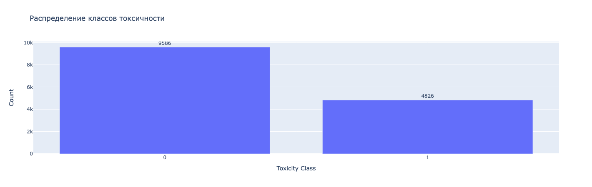
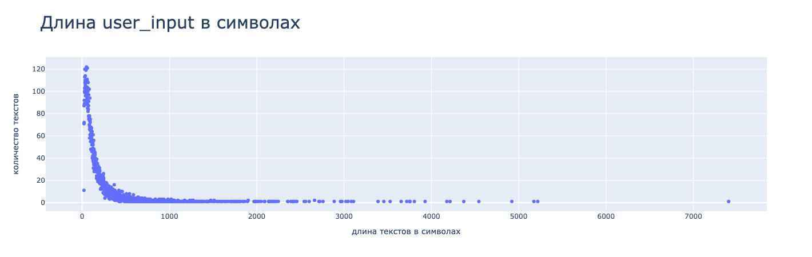
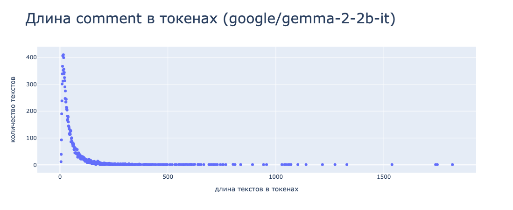
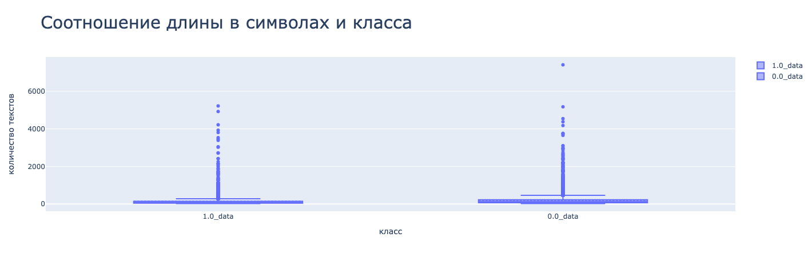
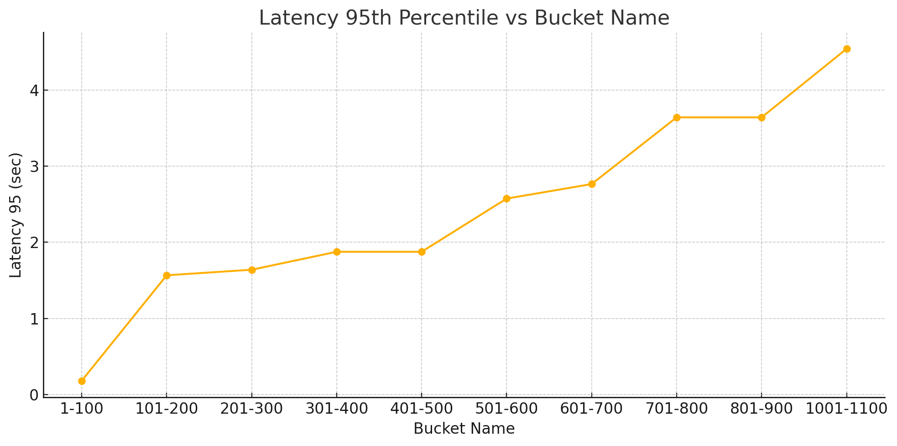
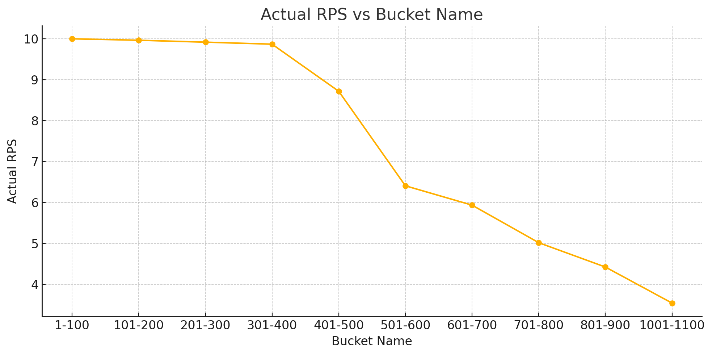

## Сервис определения токсичности текста на основе LLM моделей

Разработан сервис для автоматического определения токсичности в текстах с использованием больших языковых моделей. Работа над проектом включала полный цикл — от анализа данных до развёртывания высокопроизводительного сервиса.

Что было сделано:
* Анализ данных. Провели предварительный анализ датасета, включая распределение длин текстов, баланс классов и качество разметки.
* Обучение моделей. Выполнена серия экспериментов с использованием:
    * фреймворка Hugging Face Trainer
    * кастомного кода на PyTorch и Transformers для полной гибкости
    Модели обучались с применением LoRA-адаптеров для эффективного fine-tuning.
* Оптимизация модели. Проведена квантование модели с помощью алгоритма PTQ (AWQ) с калибровочными данными, что позволило значительно снизить требования к ресурсам без существенной потери качества.
* Сборка сервиса. Использован фреймворк vLLM для высокопроизводительного инференса. Реализован REST API.
* Docker-сборка. Сервис упакован в мультистейдж Docker-образ, что обеспечивает минимальный размер и ускоренное развёртывание.
* Нагрузочное тестирование. Проведено нагрузочное тестирование при различных длинах входных текстов. Получены метрики пропускной способности (RPS) и задержки (latency), на основе которых сделаны выводы по масштабированию.

## Данные

Источник данных: https://www.kaggle.com/datasets/blackmoon/russian-language-toxic-comments

| Персентиль (%) | Длина текста (токены) |
|----------------|------------------------|
| 25             | 18                     |
| 50             | 31                     |
| 75             | 57                     |
| 85             | 83                     |
| 95             | 151                    |
| 98             | 239                    |
| 99             | 335                    |
| Макс           | 1818                   |

* Распределения схожи: у классов 1.0 и 0.0 коробки и усы примерно одинаковы, что говорит о похожем распределении длины текстов.
* Много выбросов: есть значительное количество текстов с экстремальной длиной, особенно от 2000 до 6000+ символов — возможно, это очень длинные посты, спам или объединенные сообщения.
* Медиана и основной объём данных находятся ближе к низким значениям (в пределах первых 200–300 символов), что типично для коротких комментариев.

## Эксперименты
| Название модели                                        | Гиперпараметры                                                                                                                                                                                                                                     | F1     | Precision | Recall  |
|--------------------------------------------------------|----------------------------------------------------------------------------------------------------------------------------------------------------------------------------------------------------------------------------------------------------|--------|-----------|---------|
| 2967c40e2e_google_gemma-2-2b-it       | lora_config: task_type: CAUSAL_LM lora_r: 4 lora_bias: 'none' target_modules: ["q_proj", "v_proj"] lora_alpha: 8 init_lora_weights: gaussian 4bit data_config: task_type: cls_toxic prefix: 'токсичный текст: ' collator_type: simple max_target_len: 5 max_input_len: 256       | 0.7744 | 0.8942    | 0.6829  |
| 3858bcf862_google_gemma-2-2b-it       | lora_config: task_type: CAUSAL_LM lora_r: 16 lora_bias: "all" target_modules: ["q_proj", "k_proj", "v_proj", "o_proj", "gate_proj"] lora_alpha: 32 init_lora_weights: gaussian   4bit| 0.8627 | 0.8351    | 0.8922  |
| 363437e01b_google_gemma-2-2b-it       | data_config: max_input_len: 1024   4bit | 0.8711 | 0.8698    | 0.8725  |
| 48_077cd82859_google_gemma-2-2b-it       | target_modules: all data_config: max_input_len: 1024   4bit | 0.8812 | 0.8563    | 0.9077  |
| 42_2196e56dd3_t-bank-ai_T-lite-instruct-0.1       | target_modules: all data_config: max_input_len: 1024   4bit | 0.894 | 0.900    | 0.889  |

### Выводы по экспериментам
* Лучшие результаты показала модель 42_2196e56dd3_t-bank-ai_T-lite-instruct-0.1 с F1 = 0.894, что обеспечено высокой сбалансированностью precision (0.900) и recall (0.889).
* Модель 48_077cd82859_google_gemma-2-2b-it также продемонстрировала высокий F1 (0.8812) с уклоном в recall (0.9077), что может быть полезно при приоритете на полноту.
* Простое увеличение max_input_len (модель 363437e01b) уже даёт заметный прирост F1 (0.8711) по сравнению с базовой конфигурацией (2967c40e2e, F1 = 0.7744).
* Использование расширенного набора target_modules и более агрессивной Lora-конфигурации (модель 3858bcf862) также повышает F1 (0.8627), но с меньшим precision по сравнению с топ-моделями.

## Сервис
### Параметры нагрузочного тетсирования
n_threads=16 |
required_rps=10 |
max_num_seqs=64 |
kv_cache_dtype=fp8 

### Данные
* тестовые данные
* разбиты на группы по длине с шагом 100

### Результаты

| Bucket name | Actual RPS | latency_95 (sec) |
|-------------|------------|------------------|
| 1-100       | 9.9978     | 0.1807           |
| 101-200     | 9.9628     | 1.5661           |
| 201-300     | 9.9159     | 1.6393           |
| 301-400     | 9.8667     | 1.8750           |
| 401-500     | 8.7159     | 1.8750           |
| 501-600     | 6.4053     | 2.5735           |
| 601-700     | 5.9328     | 2.7641           |
| 701-800     | 5.0148     | 3.6403           |
| 801-900     | 4.4203     | 3.6403           |
| 1001-1100   | 3.5389     | 4.5411           |

### Выводы по результатам тестирвоания

* При длине запросов до 400 токенов сервис стабильно выдерживает заданную нагрузку (required_rps = 10), при этом latency_95 остаётся в пределах допустимого:
    * от 0.18 сек (1–100 токенов)
    * до ~1.87 сек (301–400 токенов)
* Начиная с bucket 401–500, наблюдается падение производительности:
    * RPS снижается до 8.71, что уже ниже требуемого уровня
    * Задержка перестаёт расти линейно и фиксируется на уровне ~1.87 сек
* С длиной более 500 токенов:
    * RPS резко падает: до 6.4 при 500–600 токенах и до 3.5 при 1000+
    * latency_95 превышает 4.5 сек, что критично для real-time применения
* Вывод: текущая конфигурация (16 потоков, fp8, max_num_seqs=64) эффективна для коротких и средних запросов (до ~400 токенов)
